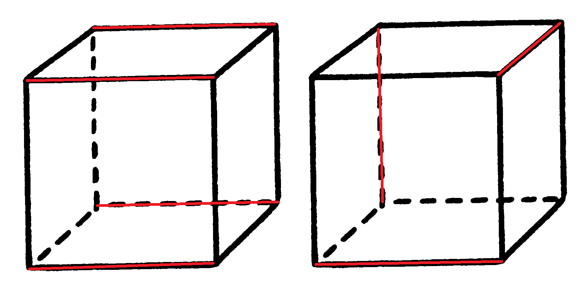

# Ruskey-Savage Conjecture

**Ruskey-Savage Conjecture** (F. Ruskey, C. Savage, 1993): a hypercube of dimension *n* is a graph whose vertices are all *n*-bit strings, with edges leading between vertices differing in a single bit. Under the still open hypothesis, every pairing (set of non-intersecting edges) in this graph can be extended to a Hamiltonian cycle (each vertex is traversed exactly once). This program tests the hypothesis for small values of *n*.

[[Source](https://ksvi.mff.cuni.cz/~dvorak/vyuka/14/NPRG005x01/programy.html), [Open Problem Garden](http://www.openproblemgarden.org/op/matchings_extends_to_hamilton_cycles_in_hypercubes)]

## How to run

1) Install GHCI 9.4.x
2) Clone this repository
3) Run `ghci`
4) Load `Main.hs` - `:l Main.hs`
   1) Run `main` (runs checks for *n* = 2, 3, 4)
   2) Run `dimensionXtest`, where `X` = 2, 3, 4
   3) Run for any other *n* > 1 - `testAllMatchings n`

## How does it work

### Creating Hypercube

Creating an *n*-dimensional hypercube is straightforward. First, we generate all possible permutations of lenght *n* of `0`s and `1`s to create the vertices (`generateHypercubeVertices`). Next, we use list comprehension to create the edges by iterating over every pair of vertices and checking if they can be neighbors (`generateHypercubeEdges`).

Additionally, a function to generate the possible neighbors of a given vertex is provided (`generateHypercubeNeighbors`).

### Maximal vs maximum matching

> A **maximal matching** is a matching $M$ of a graph $G$ that is not a subset of any other matching. ($\implies$ no additional edges from $G$ can be added to $M$ without violating the definition of maximal matching). [[Source](https://en.wikipedia.org/wiki/Matching_(graph_theory))]


> A **maximum matching** (also known as maximum-cardinality matching) is a matching that contains the largest possible number of edges. [[Source](https://en.wikipedia.org/wiki/Matching_(graph_theory))]

Both of these matchings are maximal but only the one on the left is maximum:



In this work, we only deal with **maximal matchings**.

### Finding all maximal matchings

The conjecture posits that *"every pairing/matching can be extended to a Hamiltonian cycle"*. From Combinatorics and Graph Theory I course, we know that *"every matching can be extended to a maximal matching"*. Therefore, in a finite hypercube, for every matching $M$, there exists a maximal matching $K$ such that $M \subseteq K$.

If we find a Hamiltonian cycle $H$ for a maximal matching $K$ (where $K \subseteq H$), we consequently find a Hamiltonian cycle for every $M \subseteq K$ (since $M \subseteq K \subseteq H$). This approach allows us to skip non-maximal matchings and focus solely on maximal ones.

#### Algorithm

```
M = []
While (M is not maximal):
    Select edge (v1, v2), where v1 and v2 are not in any edge in M
    M <- M ++ (v1, v2)
Return M
```

We modify this greedy algorithm to recursively take in count all possible matchings, the resulting function `maximalMatchings` returns a list of all possible maximal matchings in a given Hypercube.

### Finding Hamiltonian cycle with constraints

Conventionally, Hamiltonian cycle can be found using DFS and checking in every step, if there are any unvisited vertices left and if `end == start`. However, in our case, this is more complicated, we have some mandatory edges to go through.

One way to solve this would be to generate every Hamiltonian cycle $H$ and every maximal matching $M$ and check if $M \subseteq H$. Or we could try to extend every $M$ to a Hamiltonian cycle.

The main algorithm (`hasHamiltonCycle`) in this project is an adapted DFS algorithm. When there is a mandatory edge the algorithm traverses through it instead of trying all possible neighbors, additionally, it checks if all mandatory edges were traversed.

```
Input: vertices, mandatory edges
Output: True/False

look for cycle from v1:
    if (all vertices are visited and all mandatory edges were traversed and v1 is at the start of the cycle):
        return True
    else if (there exists a mandatory edge (v1,v2) or (v2,v1)):
        mark v2 as visited
        delete mandatory edge (v1,v2), (v2,v1)
        look from cycle from v2
    else:
        for v2 in all neighbors of v1:
            mark v2 as visited
            look for cycle from v2
        return True if any above is True else False
```

### Proving conjecture for one dimension

To prove the conjecture for dimensions $n$ we create a Hypercube of dimension $n$, then we generate all possible matchings and check if every matching has a Hamiltonian cycle.

```hs
testMatchingsInOneDimension :: Int -> Bool
testMatchingsInOneDimension n =
    let h = createHypercube n
        matchings = maximalMatchings h
    in all (hasHamiltonianCycle (vertices h)) matchings
```

## Additional resources

1) [Matchings extend to Hamiltonian cycles in hypercubes, Open Problem Garden](http://www.openproblemgarden.org/op/matchings_extends_to_hamilton_cycles_in_hypercubes)
2) [T. Valla, J. Matoušek: Kombinatorika a Grafy I](https://iuuk.mff.cuni.cz/~valla/kg.html)
3) [Hamiltonian Path/Cycle, Wikipedia](https://en.wikipedia.org/wiki/Hamiltonian_path)
4) [Matching, Wikipedia](https://en.wikipedia.org/wiki/Matching_(graph_theory))
